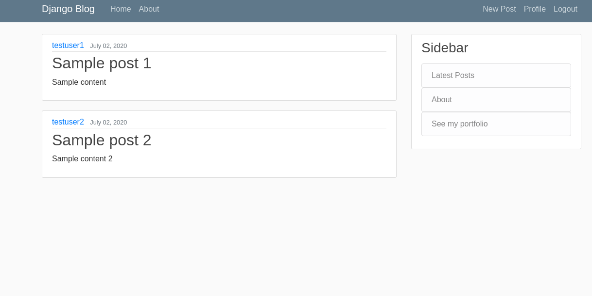
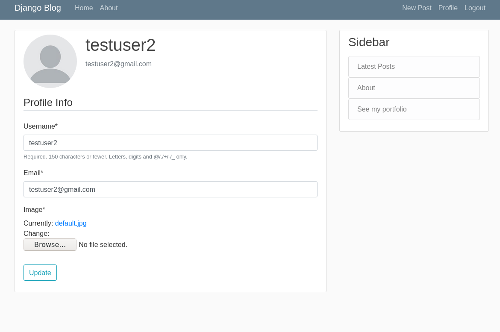

### Django blog
Welcome to my Django blog repository.
This a sample website using the Django web framework and Python 3 and is deployed to heroku . Users can login/logout, create new posts, update their previous posts, see their post history and upload a profile picture and update it later. Media files are stored in an Amazon Web Services (AWS) S3 bucket. The site can support as many users as the database (Postgresql, although sqlite3 was used in development) can support and the web hosting, of course, allows, and the project can be extended in many ways but, since this is a sample project, I didn't want to dedicate more time to it.

Thank you for visiting. You can see more of my projects here in github, or in my .

### Built with
-Django
-Crispy forms (a Django plugin, useful for styling forms)
-Python 3
-Bootstrap
-Linux
-Visual Studio Code
-AWS S3 (for serving media files)

### Steps to run in your local machine
Although this project is only meant as a sample, in case that you want to play with it and run this in your local machine, you should:
-1: Have Python, pip (some Linux distros only include a minimal version of Python, without pip, even if the Python version is greater than 2.7), and Django
-2: Install dependencies automatically with pip. Go to the root folder and type in the console: ```pip install -m requirements.txt```
-3: Modify the settings.py file to add your machine as an allowed host (such as '127.0.0.1', i.e. ``` ALLOWED_HOSTS='127.0.0.1'  ```)
-4: Go to the project root and type in the console: ```python manage.py runserver``` (or ```python3 manage.py runserver```)

### Screenshots






